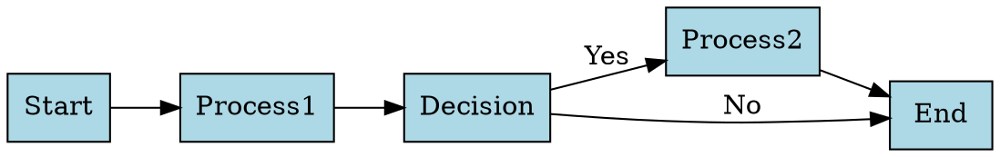

# Multi DOT Viewer - Infinite Canvas

A modern web application for viewing multiple DOT (Graphviz) diagrams on an infinite, zoomable canvas. Perfect for visualizing and comparing multiple graph structures simultaneously.

   

## ✨ Features

- **Infinite Canvas**: Pan and zoom smoothly across unlimited space
- **Multiple Diagrams**: Load and display multiple DOT files simultaneously
- **Interactive Navigation**: Click to select, double-click to focus on specific diagrams
- **Modern UI**: Clean, responsive design with intuitive controls
- **File Upload**: Support for `.dot` and `.gv` file formats
- **Keyboard Shortcuts**: Quick navigation and zoom controls
- **Automatic Layout**: Intelligent positioning of diagrams
- **Sample Diagrams**: Includes examples to get started immediately

## 🚀 Getting Started

1. **Clone or download** this repository
2. **Open** `index.html` in a modern web browser
3. **Start exploring** with the included sample diagrams
4. **Load your own** DOT files using the "Load DOT Files" button

### No setup required! The application runs entirely in the browser.

## 🎮 How to Use

### Loading Diagrams
- Click **"Load DOT Files"** to upload your own `.dot` or `.gv` files
- Multiple files can be selected at once
- Sample diagrams are loaded automatically on first visit

### Navigation
- **Pan**: Click and drag on the canvas background
- **Zoom In/Out**: Use mouse wheel or the zoom buttons
- **Select Diagram**: Click on any diagram
- **Focus on Diagram**: Double-click to center and zoom to a diagram
- **Reset View**: Click "Reset View" to return to default position

### Sidebar Controls
- **Diagram List**: Shows all loaded diagrams
- **Focus Button**: Centers the view on a specific diagram
- **Delete Button**: Removes a diagram from the canvas
- **Diagram Count**: Displays the total number of loaded diagrams

### Keyboard Shortcuts
- `Ctrl/Cmd + 0`: Reset view to default
- `Ctrl/Cmd + +`: Zoom in
- `Ctrl/Cmd + -`: Zoom out
- `Ctrl/Cmd + F`: Fit all diagrams in view

## 📁 File Structure

```
multi-dot-viewer/
├── index.html          # Main HTML file
├── styles.css          # CSS styles and layout
├── app.js              # JavaScript application logic
└── README.md           # This file
```

## 🔧 Technical Details

### Dependencies
The application uses these CDN-hosted libraries:
- **D3.js v7**: Data visualization and DOM manipulation
- **Graphviz WASM**: WebAssembly version of Graphviz for DOT rendering
- **d3-graphviz**: D3 integration for Graphviz rendering

### Browser Support
- Modern browsers with ES6+ support
- Chrome, Firefox, Safari, Edge (latest versions)
- WebAssembly support required for DOT rendering

### Architecture
- **Object-oriented design** with a main `MultiDotViewer` class
- **Event-driven** interaction handling
- **Responsive layout** using CSS Grid
- **SVG-based rendering** for scalable graphics

## 🎨 Sample DOT Files

The application includes three sample diagrams:

1. **Simple Graph**: Basic directed graph with cycles
2. **Complex Workflow**: Process flow with decision points
3. **Network Diagram**: Undirected graph showing connections

### Example DOT Syntax


## 🛠️ Customization

### Adding New Features
The modular design makes it easy to extend:
- Modify `app.js` to add new interaction modes
- Update `styles.css` for visual customization
- Extend the DOT rendering pipeline for custom layouts

### Styling
The application uses CSS custom properties for easy theming:
- Color scheme based on Tailwind CSS colors
- Responsive breakpoints at 768px
- Smooth animations and transitions

## 🐛 Troubleshooting

### Common Issues

**Diagrams not loading**
- Ensure DOT files have valid syntax
- Check browser console for error messages
- Verify WebAssembly support in your browser

**Performance with large diagrams**
- The application is optimized for multiple small-to-medium diagrams
- Very large DOT files may impact performance
- Consider breaking large diagrams into smaller components

**Browser compatibility**
- Requires modern browser with ES6+ and WebAssembly support
- Disable ad blockers that might block CDN resources

## 📝 License

This project is open source and available under the MIT License.

## 🤝 Contributing

Feel free to submit issues and enhancement requests!

---

**Built with ❤️ for the graph visualization community** 