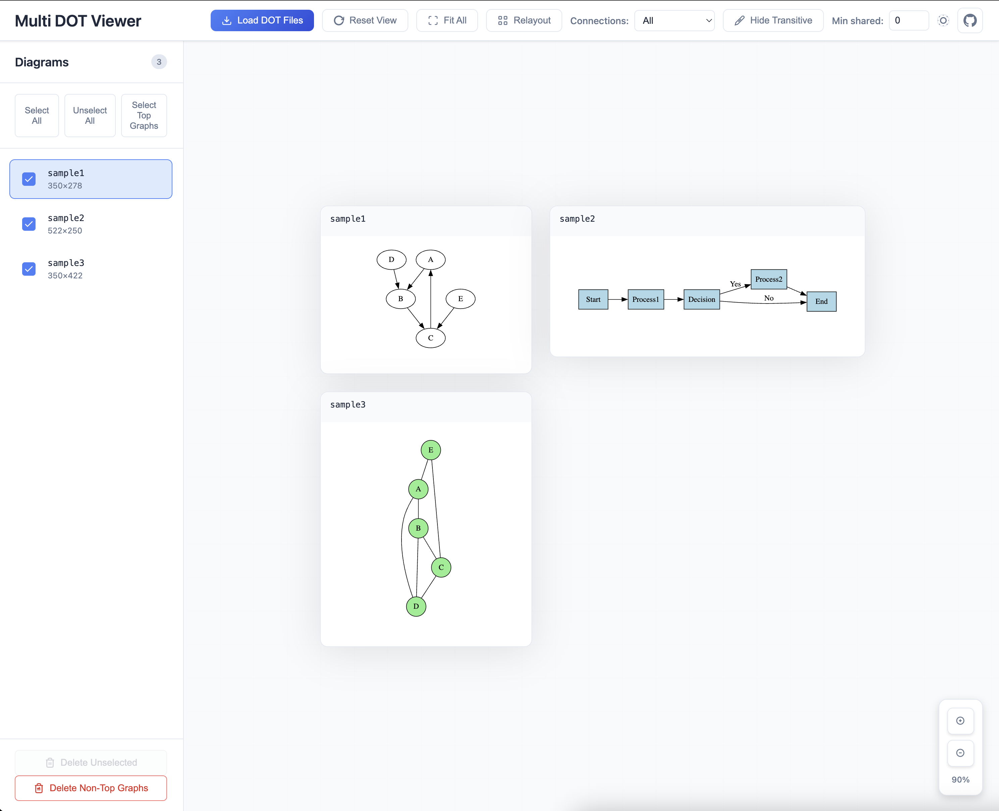
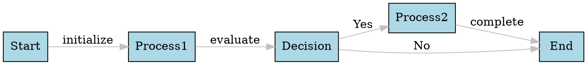

# Multi DOT Viewer - Infinite Canvas

A powerful web application for viewing and analyzing multiple DOT (Graphviz) diagrams on an infinite, zoomable canvas. Perfect for visualizing complex relationships between graph structures and understanding diagram hierarchies.

   

## 🌐 Live Demo

**Try it now**: [https://rluvaton.github.io/multi-dot-viewer/](https://rluvaton.github.io/multi-dot-viewer/)

## Screenshots



## ✨ Features

### Core Functionality
- **Infinite Canvas**: Pan and zoom smoothly across unlimited space with D3.js
- **Multiple Diagrams**: Load and display dozens of DOT files simultaneously
- **Drag & Drop**: Reposition diagrams by dragging them around the canvas
- **Smart Layout**: Automatic positioning with overlap prevention
- **Lazy Rendering**: Performance-optimized loading for large diagram sets

### Advanced Visualization
- **Connection Analysis**: Visualize relationships between diagrams based on shared labels
- **Subset Detection**: Automatic detection and visualization of diagram hierarchies
- **Connection Filtering**: Hide transitive connections and filter by minimum shared labels
- **Smart Selection**: Select top-level diagrams or filter out subsets

### Interactive Controls
- **Multi-Selection**: Checkbox-based visibility control for each diagram
- **Focus Mode**: Intelligent focusing with zoom preservation
- **Bulk Operations**: Select all, unselect all, delete unselected diagrams
- **Relayout**: Reorganize diagrams after modifications

### Modern UI/UX
- **Resizable Sidebar**: Adjustable width with drag handle (200px-600px)
- **Responsive Design**: Mobile-friendly with collapsible sidebar
- **Empty State Handling**: Helpful guidance when no diagrams are selected
- **Performance Indicators**: Connection count displays and smart auto-hiding

### File Management
- **Multiple Formats**: Support for `.dot` and `.gv` file formats
- **Duplicate Detection**: Prevents loading files with identical names
- **Progressive Loading**: Add files incrementally without clearing existing diagrams
- **Sample Diagrams**: Includes examples that auto-clear on first upload

## 🚀 Getting Started

### Option 1: Use Online (Recommended)
Visit [https://rluvaton.github.io/multi-dot-viewer/](https://rluvaton.github.io/multi-dot-viewer/) - no installation required!

### Option 2: Run Locally
1. **Clone** this repository
2. **Open** `index.html` in a modern web browser
3. **Start exploring** with the included sample diagrams

### No setup required! The application runs entirely in the browser.

## 🎮 How to Use

### Loading Diagrams
- Click **"Load DOT Files"** to upload your own `.dot` or `.gv` files
- Select multiple files at once for batch loading
- Sample diagrams load automatically on first visit

### Canvas Navigation
- **Pan**: Click and drag on empty canvas areas
- **Zoom**: Mouse wheel or zoom controls (+/- buttons)
- **Drag Diagrams**: Click and drag diagram containers to reposition
- **Reset View**: Return to default zoom and position

### Diagram Selection & Visibility
- **Checkboxes**: Control which diagrams are visible
- **Canvas Click**: Click diagrams to select without focusing
- **Sidebar Click**: Click diagram names to select and focus
- **Select All/Unselect All**: Bulk selection controls
- **Select Top Graphs**: Automatically select only top-level diagrams

### Connection Analysis
- **Shared Labels**: Gray dashed lines show diagrams with common labels
- **Subset Relationships**: Red arrows indicate when one diagram is a subset of another
- **Connection Visibility**: Toggle between "All", "Subset Only", or "None"
- **Filter Options**: Hide connections with few shared labels or transitive relationships

### Advanced Features
- **Delete Unselected**: Remove all unchecked diagrams at once
- **Delete Non-Top Graphs**: Remove all subset diagrams, keeping only comprehensive ones
- **Relayout**: Reorganize diagrams alphabetically with proper spacing

### Keyboard Shortcuts
- `Ctrl/Cmd + 0`: Reset view to default
- `Ctrl/Cmd + +`: Zoom in
- `Ctrl/Cmd + -`: Zoom out
- `Ctrl/Cmd + F`: Fit all visible diagrams in view

## 🔗 Connection Analysis

The application automatically analyzes relationships between diagrams:

### Shared Label Connections
- **Detection**: Identifies common node/edge labels between diagrams
- **Visualization**: Gray dashed lines with shared count labels
- **Filtering**: Hide connections below a minimum threshold

### Subset Relationships
- **Smart Detection**: Recognizes when all labels from one diagram exist in another
- **Hierarchy Visualization**: Red arrows pointing from comprehensive to subset diagrams
- **Transitive Filtering**: Option to hide indirect relationships (A→B→C hides A→C)

### Performance Optimization
- **Connection Caching**: Efficient O(1) lookups for relationship data
- **Smart Updates**: Only recalculates when diagrams change, not during visibility changes
- **Auto-Hide**: Connections automatically hidden when >10 diagrams are loaded

## 📁 File Structure

```
multi-dot-viewer/
├── index.html              # Main HTML application
├── styles.css              # CSS styles and responsive layout
├── app.js                  # Core application logic
├── .github/workflows/      # GitHub Actions deployment
│   └── deploy.yml          # Automated GitHub Pages deployment
└── README.md               # This documentation
```

## 🔧 Technical Details

### Dependencies (CDN)
- **D3.js v7**: Canvas interactions, zoom/pan, data binding
- **Graphviz WASM**: WebAssembly DOT rendering engine
- **d3-graphviz**: SVG generation from DOT syntax
- **dotparser**: Accurate DOT syntax parsing for label extraction

### Architecture Highlights
- **Object-Oriented Design**: Main `MultiDotViewer` class with clean separation of concerns
- **Event-Driven**: Efficient event handling with proper cleanup
- **Performance Optimized**: Lazy rendering, connection caching, efficient DOM updates
- **Memory Efficient**: Only renders visible diagrams, smart garbage collection

### Browser Requirements
- Modern browsers with ES6+ support (Chrome, Firefox, Safari, Edge)
- WebAssembly support for DOT rendering
- Minimum 2GB RAM recommended for large diagram sets

## 🎨 Sample DOT Files

Includes three demonstration diagrams:

1. **Simple Graph**: Basic directed graph with cycles
2. **Complex Workflow**: Multi-step process with decision points
3. **Network Diagram**: Undirected graph showing system connections

### Example DOT Syntax


## 🚀 Deployment

### Automatic Deployment
- **GitHub Pages**: Automatically deploys on push to main branch
- **GitHub Actions**: Uses workflow in `.github/workflows/deploy.yml`
- **Live Updates**: Changes are live within minutes of pushing

### Manual Deployment
1. Upload all files to any static web server
2. Ensure MIME types are configured for `.wasm` files
3. No server-side processing required

## 🛠️ Customization

### Extending Features
- **Modular Design**: Easy to add new analysis algorithms
- **Plugin Architecture**: Connection analysis can be extended
- **Custom Renderers**: Override DOT rendering for specialized formats

### Theming
- **CSS Custom Properties**: Easy color scheme modifications
- **Responsive Breakpoints**: Mobile-first design principles
- **Animation Controls**: Configurable transition timings

## ⚡ Performance Tips

### For Large Diagram Sets
- Use "Select Top Graphs" to focus on comprehensive diagrams
- Enable connection filtering to reduce visual complexity
- Consider splitting very large DOT files into logical components
- Use "Delete Non-Top Graphs" to remove redundant subset diagrams

### Memory Management
- The application uses lazy rendering to minimize memory usage
- Only visible diagrams consume rendering resources
- Connection caching prevents redundant calculations

## 🐛 Troubleshooting

### Common Issues

**Diagrams not rendering**
- Verify DOT syntax is valid using `dot -T svg file.dot`
- Check browser console for WebAssembly errors
- Ensure files are actual DOT format, not just renamed text files

**Performance issues**
- Try "Hide Connections" if you have many diagrams
- Use "Select Top Graphs" to focus on essential diagrams
- Consider breaking very large DOT files into smaller components

**Connection analysis problems**
- Connections are based on exact label matching
- Node and edge labels must be identical (case-sensitive)
- Use "Minimum Shared Labels" filter to reduce noise

**Mobile/responsive issues**
- Sidebar collapses automatically on small screens
- Touch gestures supported for pan/zoom
- Some features may be limited on very small screens

## 📊 Use Cases

### Software Architecture
- Visualize microservice dependencies
- Compare API schemas across versions
- Analyze database relationships

### Process Analysis
- Compare workflow variations
- Identify process overlaps and redundancies
- Visualize decision trees

### Network Analysis
- Compare network topologies
- Identify common infrastructure patterns
- Analyze system dependencies

## 📝 License

This project is open source and available under the MIT License.

## 🤝 Contributing

Contributions welcome! Areas for improvement:
- Additional connection analysis algorithms
- New visualization modes
- Performance optimizations
- Mobile UX enhancements

## 🙏 Acknowledgments

Built with powerful open-source libraries:
- D3.js team for incredible visualization tools
- Graphviz team for the foundational graph layout algorithms
- WebAssembly community for bringing native performance to the web

---

**Built with ❤️ for the graph visualization community** 